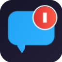

# ReplyBoi 💬

A Chrome extension that counts your replies on X (Twitter). See your reply count displayed directly on the extension icon!



## Features

- 📊 **Big counter on icon** — Your reply count displayed right on the extension icon
- 🔄 **Real-time updates** — Counter increments instantly when you reply
- ⚡ **Lightweight** — No bloat, no tracking, just counting
- 🔒 **Privacy-focused** — All data stays local, nothing sent to servers
- 🎯 **Reset anytime** — Clear your counter from the popup

## Installation

### From Chrome Web Store

Coming soon! (Pending review)

### Manual Installation (Developer Mode)

1. Clone this repository:
   ```bash
   git clone https://github.com/YOUR_USERNAME/replyboi.git
   ```

2. Open Chrome and go to `chrome://extensions/`

3. Enable **Developer mode** (toggle in top right)

4. Click **Load unpacked**

5. Select the `replyboi` folder

## Usage

1. Browse X (twitter.com or x.com) as normal
2. Every time you reply to a tweet, the counter goes up
3. Click the extension icon to see your total
4. Click "Reset Counter" to start fresh

## Development

### Project Structure

```
replyboi/
├── manifest.json      # Extension manifest (v3)
├── background.js      # Service worker (count management, icon updates)
├── content.js         # Injected into X (intercepts replies) - MAIN world
├── bridge.js          # Bridges MAIN world ↔ service worker - ISOLATED world
├── popup.html         # Popup UI
├── popup.js           # Popup logic
├── icons/             # Extension icons
├── privacy-policy.md  # Privacy policy
└── generate-*.js      # Helper scripts for generating icons
```

### Building for Chrome Web Store

```bash
zip -r replyboi-extension.zip manifest.json background.js content.js bridge.js popup.html popup.js icons/ -x "*.DS_Store"
```

### Regenerating Icons

```bash
node generate-store-icon.js
```

## How It Works

1. `content.js` runs in the page's MAIN world and intercepts `fetch` requests
2. When a `CreateTweet` API call is detected, it increments the count in `localStorage`
3. `bridge.js` (in ISOLATED world) syncs the count to the background service worker
4. `background.js` updates `chrome.storage` and redraws the icon with the new count

## Privacy

ReplyBoi does **not** collect, store, or transmit any personal data. The only data stored is a single number (your reply count) saved locally on your device.

See [privacy-policy.md](privacy-policy.md) for details.

## License

MIT

---

Made with ❤️ for the X community


